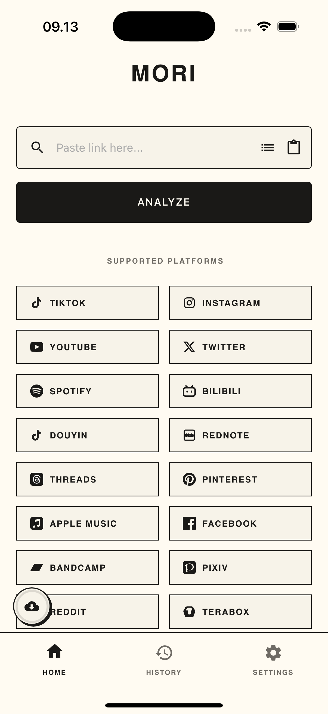
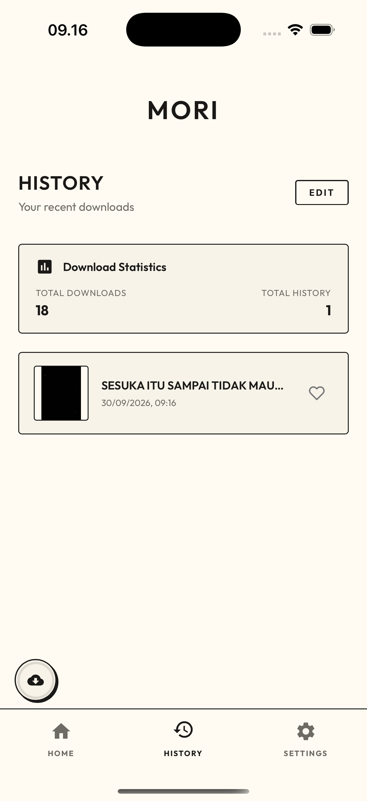
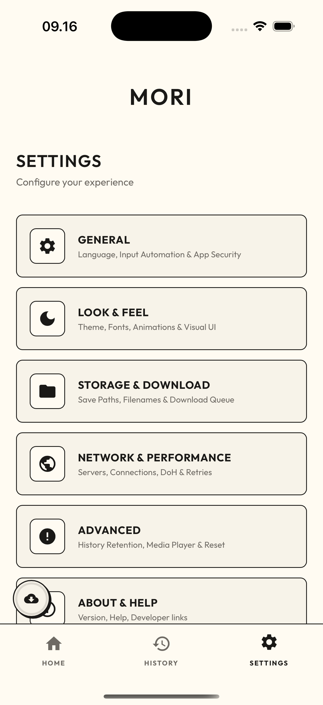
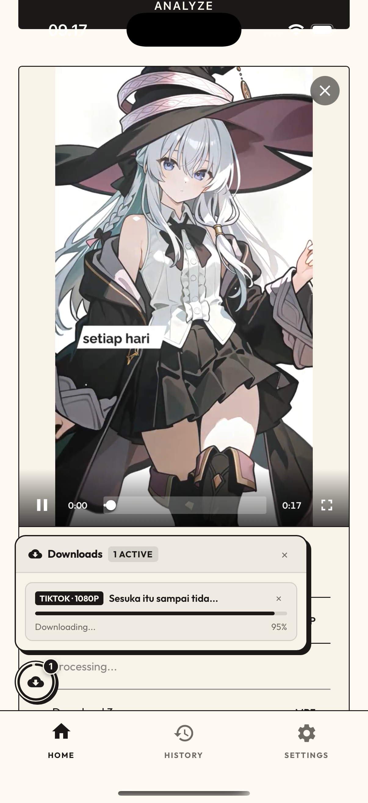
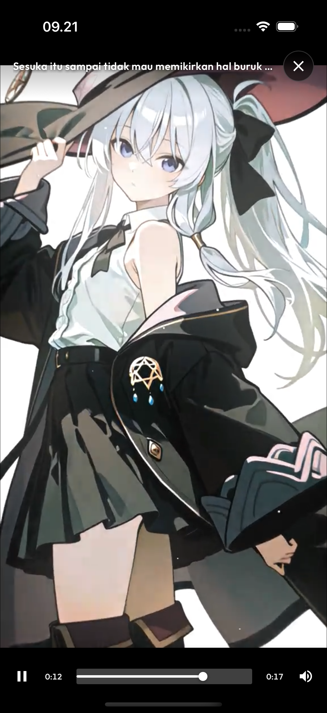
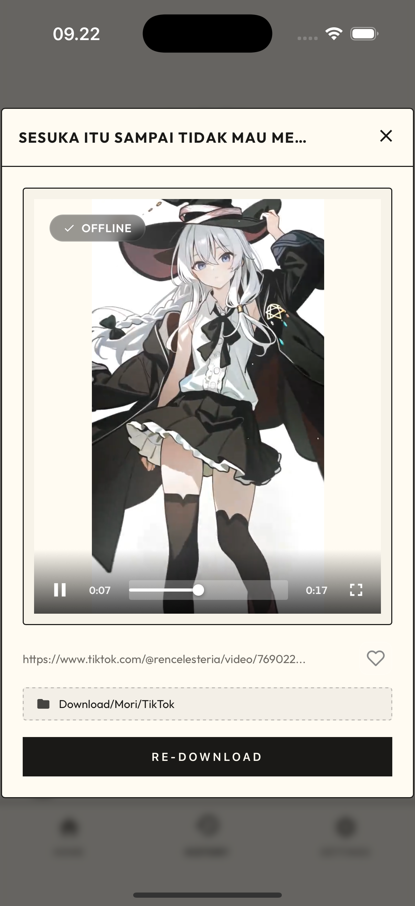

<p align="center">
  
</p>

<h1 align="center">Mori</h1>
<p align="center"><em><strong>Save anything, From anywhere.</strong></em></p>

<p align="center">
  
  
  
  
  
  
</p>

<div align="center">

Save and download videos, photos, and music from 16 platforms. No watermarks. No accounts. No tracking. Everything stays on your device.

<a href="https://sociabuzz.com/coflyn/tribe" target="_blank">
  
</a>

</div>

## 📸 Screenshots

<p align="center">
  
  
  
</p>
<p align="center">
  
  
  
</p>

---

## 📋 Table of Contents

1. [How to Use](#-how-to-use)
2. [Download & Installation](#-download--installation)
3. [Features](#-features)
4. [Supported Platforms & Scraper Engines](#-supported-platforms--scraper-engines)
5. [For Developers & Building from Source](#-for-developers--building-from-source)
6. [Scraper Architecture](#-scraper-architecture)

7. [Disclaimer](#-disclaimer)
8. [License & Terms of Use](#-license--terms-of-use)

---

## 🚀 How to Use

Saving media with Mori takes only three simple steps:

1. **Copy Link**: Copy any video, photo, or music link from your favorite app (TikTok, Instagram, YouTube, Spotify, etc.).
2. **Open Mori**: Mori automatically detects the link from your clipboard and analyzes it right away. _(On Android, you can also just tap **Share** on any post and choose **Mori** to download directly without leaving the app!)_
3. **Download**: Pick your preferred quality (HD video without watermarks, audio MP3, or photo gallery) and tap **Download**. Your media is saved straight to your device's gallery or music folder.

## 📥 Download & Installation

Pre-compiled, ready-to-use packages are available for all devices on **[GitHub Releases](https://github.com/coflyn/Mori/releases)**.

| Platform                                                                                                                        | Available Packages                                                | Installation Guide                                                                  |
| :------------------------------------------------------------------------------------------------------------------------------ | :---------------------------------------------------------------- | :---------------------------------------------------------------------------------- |
|  **Android**                                                 | `Mori v...apk`                                                    | [Installation & Play Protect Guide](GUIDE.md#android-installation--troubleshooting) |
|  **macOS**                                                     | `Mori-v...-macOS-arm64.dmg`<br>`Mori-v...-macOS-arm64.app.tar.gz` | [Gatekeeper Quarantine Fix](GUIDE.md#macos-installation--gatekeeper-fix)            |
|  **Windows** | `Mori-v...-Windows-x64-Setup.exe`<br>`Mori-v...-Windows-x64.msi`  | [Windows Setup Guide](GUIDE.md#windows-installation)                                |
|  **iOS**                                                       | `Mori v...ipa`                                                    | [AltStore / TrollStore Sideloading](GUIDE.md#ios-sideloading-guide)                 |

> 📖 **Need help installing or troubleshooting?**  
> Read the complete **[Installation, Sideloading & User Guide (GUIDE.md)](GUIDE.md)**.

## 📜 Features

- **16 Platforms in One App**: Save watermark-free videos, high-resolution photos, and audio from TikTok, Instagram, YouTube, Twitter/X, Spotify, Apple Music, Pinterest, Facebook, Threads, Bandcamp, Pixiv, Bilibili, Douyin, RedNote, Reddit, and TeraBox.
- **Over-The-Air (OTA) Scraper Hot-Patching**: Never wait for app updates when a platform changes its API. Mori seamlessly hot-patches scraper engines in the background without needing to reinstall the app.
- **Custom Directory & Storage Freedom**: Pick any folder across your device storage (including SD cards, Movies, Downloads, and custom folders) with native folder pickers and full file management support.
- **One-Tap Playlists & Albums**: Download full music albums or playlists from **Spotify**, **Apple Music**, and **YouTube** in one click instead of saving songs one by one.
- **High-Speed Concurrent Downloads**: Download music albums, playlists, and multi-photo galleries in parallel with up to 5 concurrent worker threads for blazing fast speeds.
- **Floating Download Bubble & Manager**: Non-intrusive monochrome floating bubble tracking active tasks in real-time with an aggregated progress ring, expandable dropup tray, individual task progress bars, and instant cancellation.
- **Quick Save via Android Share Menu**: Spot a video you love? Tap **Share** in any app and select Mori to download it instantly in a neat overlay without switching apps.
- **Multi-Link Batch Mode**: Paste several links at once and let Mori queue and download them all automatically in the background.
- **Built-in Custom Fullscreen Player & Preview**: Play videos, stream tracks, and browse photo carousels right inside the app with a sleek custom fullscreen player, real-time title bar, smooth seek scrubbing, double-tap seek, and mute controls.
- **Instant Photo-to-PDF**: Combine photo galleries or multi-image posts into a single, clean PDF file for offline reading or sharing.
- **PIN & Biometric Lock**: Protect your download history with an optional 4-digit PIN code or fingerprint / Face ID lock.
- **Clean Folder Organization**: Files are neatly organized in standard system folders (`Movies/Mori`, `Music/Mori`, `Pictures/Mori`) for easy access in your gallery.
- **Automatic Clipboard Detection**: Opening Mori automatically suggests your copied link for instant one-tap downloading.
- **Background Downloads**: Large videos and playlists keep downloading seamlessly even when you minimize the app or turn off the screen.
- **Anti-Corrupt File Protection**: Files are saved securely—media only appears in your gallery once 100% complete, preventing broken or unplayable files.
- **Modern Themes & Live Backgrounds**: Choose from elegant dark modes and interactive animated backgrounds (Stars, Waves, Fireflies).
- **9 Languages**: English, Indonesian, Japanese, Korean, Simplified Chinese, Arabic (with RTL support), Russian, Tagalog, and Hindi.
- **100% Private & Ad-Free**: No ads, no analytics, no accounts required, and zero external hosting. Everything runs on your device.

## 🌐 Supported Platforms & Scraper Engines

| Platform                                                                               | Supported Domains / Formats                                    | Features                     | Scraper Engine / Provider                                                               |
| :------------------------------------------------------------------------------------- | :------------------------------------------------------------- | :--------------------------- | :-------------------------------------------------------------------------------------- |
|  **Instagram**    | `instagram.com` (`/p/`, `/reel/`, `/stories/`)                 | Reels / Stories / Photos     | **InDown** (`indown.net`) & **SnapSave** (`snapsave.app`)                               |
|  **TikTok**          | `tiktok.com`, `vt.tiktok.com`                                  | Video (No WM) / Slide Photos | **TikDownloader** (`tikdownloader.io`) & **TikTokIO** (`tiktokio.com`)                  |
|  **YouTube**        | `youtube.com`, `youtu.be`, `music.youtube.com`                 | Playlist / Album / MP4 / MP3 | **Ytmp3.gg** (`media.ytmp3.gg`) & **Ytmp3.mobi** (`ytmp3.mobi`)                         |
|  **Twitter (X)**          | `twitter.com`, `x.com`                                         | HD Video / GIFs              | **TwitterVideoDownloader** (`twittervideodownloader.com`) & **SaveTWT** (`savetwt.com`) |
|  **Spotify**        | `open.spotify.com` (`track`, `album`, `playlist`, `/s/`)       | Playlist / Album / MP3       | **SpotiDown** (`spotidown.app`) & **SoundLoaders** (`spotimate.app`)                    |
|  **Apple Music** | `music.apple.com`                                              | Album / Playlist / MP3 Track | **AplMate** (`aplmate.com`)                                                             |
|  **Pinterest**    | `pinterest.com`, `pin.it`                                      | Video / HD Images            | Direct `pinimg.com` Parser & **PinDown** (`pindown.io`)                                 |
|  **Facebook**      | `facebook.com`, `fb.watch`                                     | Reels / HD Video             | **SnapSave** (`snapsave.app`)                                                           |
|  **RedNote**    | `xiaohongshu.com`, `xhslink.com`, `xhslink.cn`, `rednote.com`  | HD Photos / Videos           | Direct `__INITIAL_STATE__` SSR Extractor                                                |
|  **Threads**        | `threads.com`                                                  | Video / Photo Carousel       | **Threadster** (`threadster.app`)                                                       |
|  **Bilibili**      | `bilibili.com`, `b23.tv`, `bili.im`, `bilibili.tv`             | Video / Audio (DASH 1080p)   | Direct Bilibili Web API (`api.bilibili.com` & `api.bilibili.tv`) & Wbi Resolver         |
|  **Pixiv**            | `pixiv.net` (`artworks`)                                       | Gallery / Ugoira to MP4      | Direct Pixiv AJAX API & Ugoira Zip-to-MP4 Converter                                     |
|  **Douyin**          | `douyin.com`, `v.douyin.com`                                   | Video (No WM) / Photos       | Direct `iesdouyin.com` API & Multi-Marker SSR Resolver                                  |
|  **Bandcamp**      | `*.bandcamp.com`                                               | Track / Album / MP3          | **BandcampDownloader** (`bandcampdownloader.app`)                                       |
|  **Reddit**          | `reddit.com`, `redd.it`                                        | HD Video (Audio) / Photos    | **RapidSave** (`rapidsave.com`)                                                         |
|  **TeraBox**            | `terabox.com`, `teraboxapp.com`, `1024tera.com`, `teraboxlink` | Direct File / Stream (m3u8)  | **Sechno** (`sechno.com`)                                                               |

## 🛠️ For Developers & Building from Source

Interested in customizing the interface, contributing translations, or compiling binaries locally?

👉 **[Contributing & Build Guide (CONTRIBUTING.md)](CONTRIBUTING.md)** — Complete prerequisites, environment setup, and compilation instructions for Android, iOS, macOS, and Windows.  
📜 **[Release History & Changelog (CHANGELOG.md)](CHANGELOG.md)** — Detailed version-by-version release logs.

<details>
<summary><b>🔍 Click to view Tech Stack & Project Structure</b></summary>

### Built With

- **JavaScript (ES6+)**: Core application logic and client-side UI.
- **HTML5 & CSS3**: Custom responsive design system with dark mode and smooth animations.
- **Tauri v2 (Rust)**: Ultra-lightweight desktop engine for macOS & Windows (`.dmg`, `.app`, `.msi`, `.exe`).
- **CapacitorJS**: Native Android and iOS bridge for filesystem, share sheet, clipboard, and biometrics.
- **OkHttp (Native Android)**: High-performance native HTTP engine to seamlessly bypass WebView CORS and network restrictions.
- **Cheerio & Axios**: Fast DOM HTML parsing and HTTP client request handling.
- **pdf-lib**: Client-side PDF generation and bundling.

### Project Structure

```
Mori/
├── android/                    # Capacitor Android native project
│   ├── app/src/main/
│   │   ├── java/com/mori/downloader/
│   │   │   ├── DownloadForegroundService.java # Background download persistent service & wake-lock
│   │   │   ├── MainActivity.java   # Main Activity + native HTTP bridge (CORS bypass)
│   │   │   └── ShareActivity.java  # Native Quick Save Share overlay & MediaStore indexer
│   │   └── res/                # Android layout, drawables, XML configs & splash screens
│   └── gradle/                 # Gradle build scripts & configurations
├── ios/                        # Capacitor iOS Xcode workspace
│   └── App/                    # iOS Xcode project, Info.plist, and CocoaPods
├── src-tauri/                  # Tauri v2 Desktop Rust backend (macOS & Windows)
│   ├── capabilities/           # Application permissions & security capabilities
│   ├── src/                    # Rust native HTTP & local filesystem provider
│   └── tauri.conf.json         # Desktop app configuration & window bounds
├── assets/                     # App icons, mockups, & screenshots
├── public/                     # Frontend web assets (Vanilla JS + CSS)
│   ├── css/                    # Modular CSS architecture
│   │   ├── variables.css       # Design tokens, themes (dark/light), typography, glass, corner presets
│   │   ├── base.css            # CSS reset, typography, header, dynamic greeting, bottom navigation
│   │   ├── components.css      # Reusable buttons, custom toast, floating download bubble & dropup manager
│   │   ├── home.css            # URL input bar, batch textarea, skeleton loader, media preview cards, custom fullscreen
│   │   ├── history.css         # History layout, summary stats card, cards, actions bar, thumbnail overlay
│   │   ├── settings.css        # Settings menu list, sub-page slide transitions, custom dropdowns
│   │   ├── modals.css          # Modal overlays, PIN keypad, user guide, confirm & info dialogs
│   │   ├── rtl.css             # Right-to-Left (RTL) language overrides for Arabic [dir="rtl"]
│   │   └── style.css           # Master stylesheet entry point with sequential @import rules
│   ├── js/
│   │   ├── app.js              # Main application entry point & startup lifecycle
│   │   ├── components/         # Reusable UI components
│   │   │   └── player.js       # In-app media player (custom fullscreen overlay, gestures, smooth scrubbing)
│   │   ├── downloader/         # Modular native download engine
│   │   │   ├── filename.js     # Extension resolution, title sanitization, template & folder logic
│   │   │   ├── headers.js      # Platform-specific Referer/Origin headers builder & URL unwrapper
│   │   │   ├── resolver.js     # Asynchronous link resolver (YouTube, Spotify, Apple Music, workers)
│   │   │   ├── storage.js      # Desktop/Mobile filesystem persistence, retry loops, temp cleanup
│   │   │   ├── postProcess.js  # MediaScanner, feedback haptics/audio, tray notifications, UI reset
│   │   │   └── index.js        # Barrel re-export for downloader sub-modules
│   │   ├── i18n/               # Multi-language translations (9 languages + RTL support)
│   │   │   ├── locales/        # Modular locale dictionaries (en, id, ja, ko, zh, ar, ru, tl, hi)
│   │   │   └── index.js        # Translation registry, t() helper, and fallback resolver
│   │   ├── modules/            # Core business logic & application state
│   │   │   ├── authManager.js  # PIN passcode & biometric lock system
│   │   │   ├── batchManager.js # Multi-link batch queue & playlist manager
│   │   │   ├── bgAnimation.js  # Interactive Live Canvas backgrounds (Stars, Waves, etc.)
│   │   │   ├── core.js         # Shared global state, DOM references, constants
│   │   │   ├── download.js     # Analysis pipeline & download controllers
│   │   │   ├── history.js      # Download history manager, local storage, & cleanup
│   │   │   ├── intents.js      # Auto-clipboard detection & deep link receiver
│   │   │   ├── modals.js       # Confirmation dialogs & information modals
│   │   │   ├── settings/       # Modular user settings & configuration subsystem
│   │   │   │   ├── nativeSync.js # Native SharedPreferences bridge & platform detection
│   │   │   │   ├── appearance.js # Themes (dark/light), color accents, fonts, & visual presets
│   │   │   │   ├── behavior.js   # Toggles (incognito, data saver, Wi-Fi only, keep awake, anti-403)
│   │   │   │   ├── storage.js    # Download subfolder pickers, cache cleanup, wipe data & stats
│   │   │   │   ├── language.js   # Dropdown select engine, i18n switcher, sub-page navigation
│   │   │   │   └── index.js      # Barrel re-export for settings sub-modules
│   │   │   ├── settings.js     # User preferences orchestrator & backward-compatible facade
│   │   │   ├── update.js       # Automatic GitHub release update checker
│   │   │   └── updateScrapers.js # OTA scraper hot-patch downloader & validator
│   │   ├── scrapers/           # Scraper runtime loader & HTTP helper
│   │   │   ├── bundle.js       # Bundled scraper core (esbuild IIFE, all 16 platforms)
│   │   │   ├── httpHelper.js   # Unified HTTP engine (native OkHttp/Tauri bridge + UA rotation)
│   │   │   └── index.js        # Runtime loader with OTA hot-patch support
│   │   ├── ui/                 # UI rendering & presentation layer
│   │   │   ├── downloadBubble.js # Persistent floating download bubble & dropup task manager
│   │   │   ├── nativeDownload.js # Native download flow orchestrator & progress tracking
│   │   │   ├── result.js       # Analysis results view, media slider, & PDF creator
│   │   │   └── resultModal.js  # Detailed preview modal & folder path navigator
│   │   ├── share.js            # Android Quick Save Share Overlay controller
│   │   ├── ui.js               # History rendering & gesture handlers (long-press delete)
│   │   ├── utils/              # Helper utilities subsystem
│   │   │   ├── plugins.js      # Capacitor native plugin registry & auto-sync lifecycle
│   │   │   ├── http.js         # User-Agent presets, cookie parser, query serializer, error handler
│   │   │   ├── device.js       # Haptic feedback triggers, clipboard writer, wake lock, Wi-Fi guard
│   │   │   ├── toast.js        # Standard notification toasts & action feedback alerts
│   │   │   ├── sound.js        # Web Audio API procedural synthesizer & sound pack generator
│   │   │   ├── media.js        # Video canvas thumbnail generator & playback safe controls
│   │   │   ├── pdfHelper.js    # PDF generation & image bundling via pdf-lib
│   │   │   ├── urlUtils.js     # URL sanitization & tracking parameter remover
│   │   │   └── index.js        # Barrel re-exporter providing 100% backward compatibility
│   │   └── vendor/             # Bundled third-party libraries (pdf-lib)
│   │       └── pdf-lib.min.js
│   ├── index.html              # Main single-page application markup
│   └── share.html              # Standalone Android Quick Save Share Overlay markup
├── capacitor.config.json       # Capacitor cross-platform configuration
├── package.json                # Project dependencies & build scripts
├── CHANGELOG.md                # Detailed version-by-version release history
├── CONTRIBUTING.md             # Developer setup, build guidelines, & PR instructions
├── GUIDE.md                    # In-app user manual & usage walkthrough
├── LICENSE                     # GNU General Public License v3.0
└── README.md                   # Primary project overview & documentation
```

</details>

## 🔧 Scraper Architecture

Mori's scraper core is bundled via esbuild into `public/js/scrapers/bundle.js` — a plain minified IIFE containing all 16 platform scrapers.

- **OTA Hot-Patching**: When a platform changes its API, Mori can silently download and apply an updated `bundle.js` from GitHub without requiring a full app update.
- **Open Client Architecture**: The entire frontend, UI design system, and core app logic remain **100% open source under GPL-3.0**.
- **Collaborative Development**: Honest developers who want to improve scrapers or fix broken endpoints are always welcome to coordinate through [CONTRIBUTING.md](CONTRIBUTING.md).

## ⚖️ Disclaimer

- **Personal & Educational Use Only**: Mori is an open-source educational utility designed solely for personal media archiving and research. Users are solely responsible for complying with local copyright laws and the terms of service of source platforms.
- **Zero Media Hosting**: Mori does not host, stream, cache, or redistribute any media on external servers. All operations execute strictly on-demand directly on the user's local device.
- **Respect for Third-Party Providers**: Mori acts purely as a client-side wrapper querying publicly available web endpoints. If you are an operator or developer of an upstream service and wish to have your endpoint excluded or removed from Mori, please reach out via GitHub Issues or email (riazrepo@gmail.com), and we will promptly accommodate your request.

## 📄 License & Terms of Use

Mori is free and open-source software licensed under the **[GNU General Public License v3.0 (GPL-3.0)](LICENSE)**.

- **Copyleft Enforcement**: Anyone who modifies or distributes copies of this software is strictly required to provide the complete corresponding source code under the same GPL-3.0 license.
- **No Unauthorized Commercial Re-selling**: Packaging, rebranding, or distributing closed-source, paid, or monetized variants of Mori without honoring GPL-3.0 requirements violates copyright law and will be subject to official DMCA takedowns.
- **Trademark & Identity**: The name "Mori", app logo, and associated visual designs are the property of the original author. Derivative works must be clearly distinguished and must not claim affiliation with the original project.

---

Developed with ❤️ by coflyn.  
GitHub: https://github.com/coflyn  
Instagram: @\_coflyn
